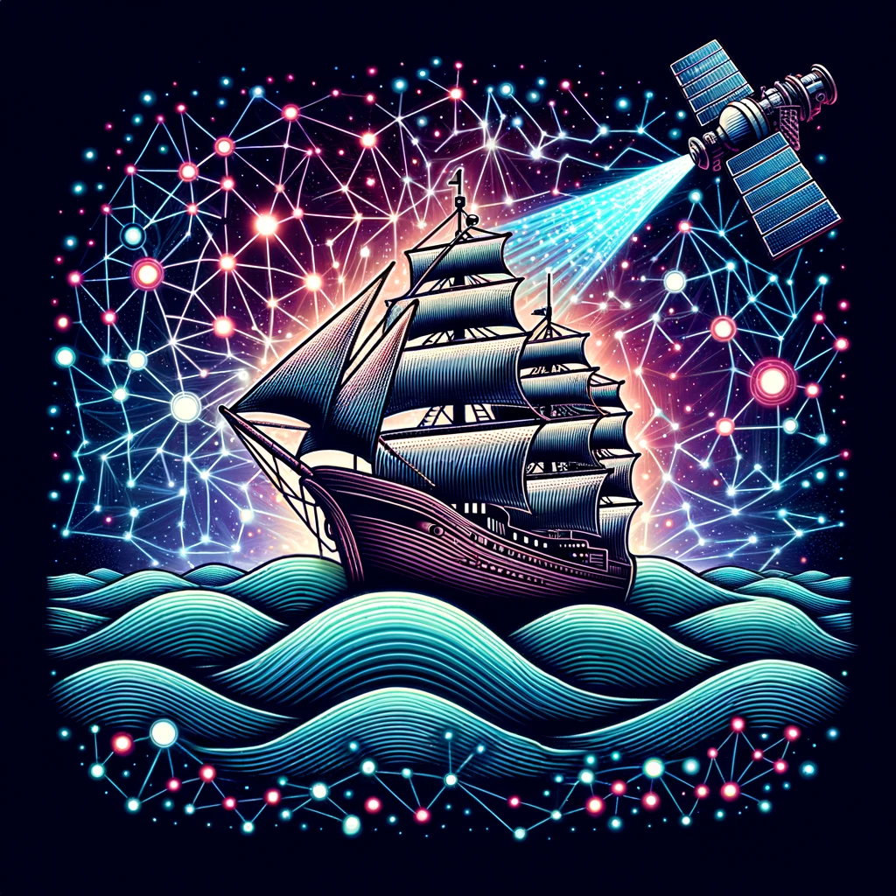

# Convolution_Crusaders - Automated Vessel Detection in Satellite Imagery

**Team Members:**
- Fábián Csenge (KGM10V)
- Faluvégi Ármin (WYL4R7)
- Kubinyi Bálint (OMJWZ6)

**Project Link:** [Kaggle Competition - Airbus Ship Detection](https://www.kaggle.com/competitions/airbus-ship-detection/overview)

## 🚢 Project Description:
As part of our school project, the Convolution_Crusaders team is venturing into the domain of satellite image analysis. Our primary objective is to develop a cutting-edge solution that can swiftly and accurately detect ships, even under challenging conditions such as cloud cover or fog.

### 🌊 Background:
The global maritime domain has witnessed a notable surge in traffic over recent years. This increase, while indicative of thriving global trade, also brings with it potential risks. From environmental concerns like catastrophic shipwrecks to security threats like piracy, illegal fishing, and unauthorized cargo movement, the implications are vast and varied.

In light of these challenges, several organizations, from environmental bodies to governmental agencies, are emphasizing enhanced marine surveillance. This underscores the importance and relevance of our project.

### 🛰️ Our Approach:
Our endeavor is rooted in offering comprehensive maritime monitoring services. We emphasize:
- **Extensive Coverage:** Ensuring a broad surveillance scope.
- **Detail Orientation:** Capturing even the minute aspects of maritime activities.
- **Intensive Monitoring:** Continual and rigorous oversight of marine zones.
- **Prompt Response:** Ensuring swift reactions to potential threats.
- **In-depth Analysis:** Leveraging seasoned expertise for insightful maritime interpretations.

By amalgamating specialized datasets with analytical prowess, our goal is to offer the maritime industry a tool that not only provides increased situational awareness but also aids in proactive threat mitigation.

While there have been commendable advances in leveraging satellite imagery for object detection in the past decade, their real-world application has been somewhat restrictive. Our project aims to bridge this gap, enhancing the accuracy and speed of automated ship detection.

## 🛠️ Reproducing the Solution:
To reproduce our solution, follow these steps:

### 1. Access the Shared Google Drive Folder:
- Navigate to the shared folder [dataa](https://drive.google.com/drive/folders/1nbnWUDDV68Y9KYsXB0Sjz1fs6-UJLqbu?usp=drive_link) on Google Drive.
   Right-click on the ‘data4’ folder.
- Select ‘Add shortcut to Drive’.
- Choose ‘My Drive’ and click ‘Add Shortcut’.

### 2. Mount Google Drive in Colab
- Run the provided script in the first code cell of the Colab notebook to mount your Google Drive.
- Follow the on-screen instructions to authorize access.

### 3. Execute the Colab Notebook:
- Execute the code cells in the Colab notebook sequentially.
  
---

## 📚 References:
For more details on the competition and the challenge, please visit the [Kaggle Airbus Ship Detection Overview](https://www.kaggle.com/competitions/airbus-ship-detection/overview).

---
